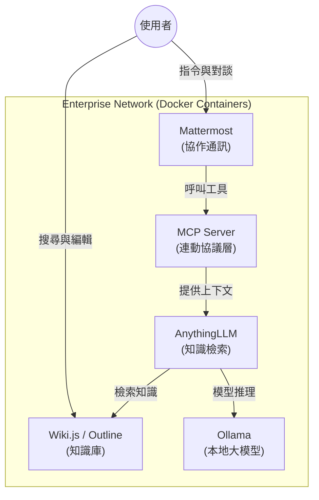

# 企業內部 AI 知識整合平台 (Enterprise AI Knowledge Integration)

本專案致力於研究與實作企業內部的知識整合與協作系統，核心技術採用 Container 部署。

## 🏗️ 系統架構 (Architecture)

## 整合工具鏈
- **知識庫 (Wiki)**: Wiki.js / Outline
- **協作通訊 (Chat)**: Mattermost
- **本機腦 (Local LLM)**: Ollama
- **知識檢索與 RAG**: AnythingLLM
- **連動協議**: MCP (Model Context Protocol)

## 技術架構 (Technical Architecture)
所有系統環境變數、Docker Compose 配置與連線設定將記錄於此 GitHub 專案。

## 應用與研究 (Applications)
實際的業務流程應用、使用者情境與功能測試進度將記錄於 [Notion](https://www.notion.so/fdjyclaw-2f9d0ca2817080ae989eff5f9efbd8bf)。
