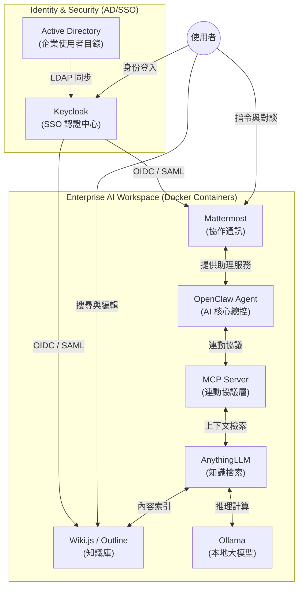

# 企業內部 AI 知識整合平台 (Enterprise AI Knowledge Integration)

本專案致力於研究與實作企業內部的知識整合與協作系統，核心技術採用 Container 部署。

## 🏗️ 系統架構 (Architecture)

```mermaid
graph TD
    subgraph "Identity & Security (AD/SSO)"
        AD["Active Directory<br/>(企業使用者目錄)"]
        KC["Keycloak<br/>(SSO 認證中心)"]
    end

    subgraph "Enterprise AI Workspace (Docker Containers)"
        Wiki["Wiki.js / Outline<br/>(知識庫)"]
        Chat["Mattermost<br/>(協作通訊)"]
        OC["OpenClaw Agent<br/>(AI 核心總控)"]
        RAG["AnythingLLM<br/>(知識檢索)"]
        Ollama["Ollama<br/>(本地大模型)"]
        MCP["MCP Server<br/>(連動協議層)"]
    end

    AD -->|LDAP 同步| KC
    KC -->|OIDC / SAML| Wiki
    KC -->|OIDC / SAML| Chat
    
    User((使用者)) -->|身份登入| KC
    User -->|搜尋與編輯| Wiki
    User -->|指令與對談| Chat
    
    Chat <-->|提供助理服務| OC
    OC <-->|連動協議| MCP
    MCP <-->|上下文檢索| RAG
    RAG <-->|內容索引| Wiki
    RAG <-->|推理計算| Ollama
```

## 整合工具鏈
- **身份驗證 (Auth)**: Keycloak + Active Directory
- **知識庫 (Wiki)**: Wiki.js / Outline
- **協作通訊 (Chat)**: Mattermost
- **AI 代理 (Agent)**: OpenClaw
- **本機腦 (Local LLM)**: Ollama
- **知識檢索與 RAG**: AnythingLLM
- **連動協議**: MCP (Model Context Protocol)

## 技術架構 (Technical Architecture)
所有系統環境變數、Docker Compose 配置與連線設定將記錄於此 GitHub 專案。

## 應用與研究 (Applications)
實際的業務流程應用、使用者情境與功能測試進度將記錄於 [Notion](https://www.notion.so/fdjyclaw-2f9d0ca2817080ae989eff5f9efbd8bf)。

## 🗺️ 路線圖 (Roadmap)
- [x] NVIDIA NIM Embedding 整合測試 (2026-02-23)
- [x] Notion 知識庫整合邏輯設計 (2026-02-23)
- [ ] Notion API Ingestion Service 開發
- [ ] Confluence Webhook 同步機制實作
- [ ] Keycloak 群組權限自動映射至向量庫
- [ ] Mattermost 核保專家 AI 流程優化

## 🚀 快速開始 (Development)

### 1. 使用 GitHub Codespaces (推薦)
1. 在 GitHub 倉庫點擊 **Code** -> **Codespaces** -> **Create codespace on main**。
2. 環境會自動配置 Python 3.11, Docker, pgvector 以及所有依賴。
3. 啟動後，直接執行 `pytest enterprise-ai-knowledge-integration/tests/` 即可進行測試。

### 2. 使用 GitHub Actions (CI)
- 每次 `push` 到 `main` 或 `feature/*` 都會自動觸發 CI。
- 測試包含：啟動真實 `pgvector` 容器、執行 `pytest`、產出測試報告與覆蓋率 (Artifacts)。
- 手動觸發：到 **Actions** -> **Enterprise AI Knowledge Integration CI (Enhanced)** -> **Run workflow**。

### 3. 本地手動部署 (Docker Compose)
1. 確保已安裝 Docker。
2. 執行 `docker-compose up -d` 啟動資料庫。
3. 安裝依賴：`pip install -r requirements.txt`。
4. 執行 Webhook 伺服器：`python webhook_server.py`。
