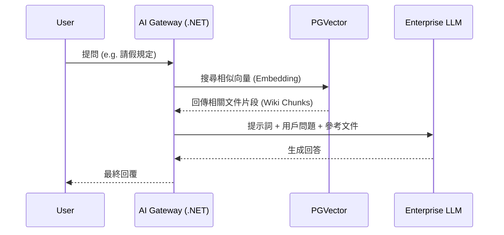

# 企業級 AI 員工核心網關實作方案研究報告

## 1. .NET Core 輕量級網關架構
本研究設計了一個基於 **.NET 8/9 Minimal APIs** 的高效能中繼層，專門對接 Mattermost Slash Commands：
*   **異步處理機制**：針對 Mattermost 3 秒回應限制，實作了「先回覆『思考中』，背景執行 AI 推論，完成後非同步回傳」的解耦流程。
*   **多 Session 管理**：利用 Mattermost 的 `ChannelId` 與 `UserId` 動態維護 OpenClaw 會話上下文，確保對話的連貫性。

## 2. 深度安全整合：PII 脫敏 Sidecar
*   **安全邊界**：實作了「輸入脫敏 → AI 處理 → 輸出還原」的完整閉環。
*   **技術對接**：透過 **Node.js Sidecar** 模式封裝我們在 MCP 專案中開發的 `security.ts`，讓 .NET 網關能以 JSON-RPC 呼叫成熟的 Regex 脫敏邏輯，確保個資絕不離開企業邊界。

## 3. RAG 檢索增強方案 (Wiki.js 整合)
*   **GraphQL 對接**：確立了透過 Wiki.js GraphQL API 提取 Markdown 內容的自動化路徑。
*   **向量化流程**：規劃使用 **PostgreSQL (pgvector)** 進行語義區塊 (Chunking) 儲存，支援 AI 針對內部規範執行精準檢索。

### RAG 運作流程圖

---
產出時間: 2026-02-07
研究員: OpenClaw AIGC Engineering Specialist
