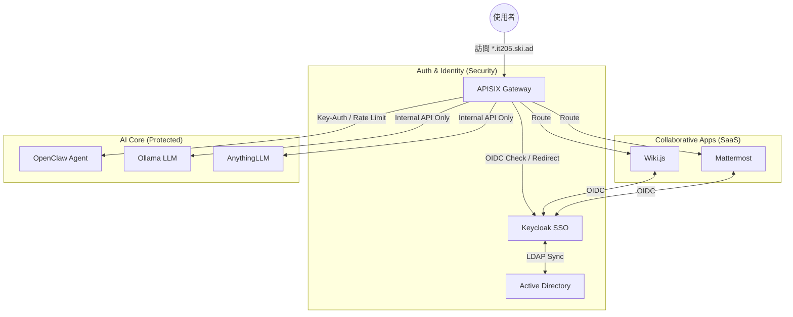
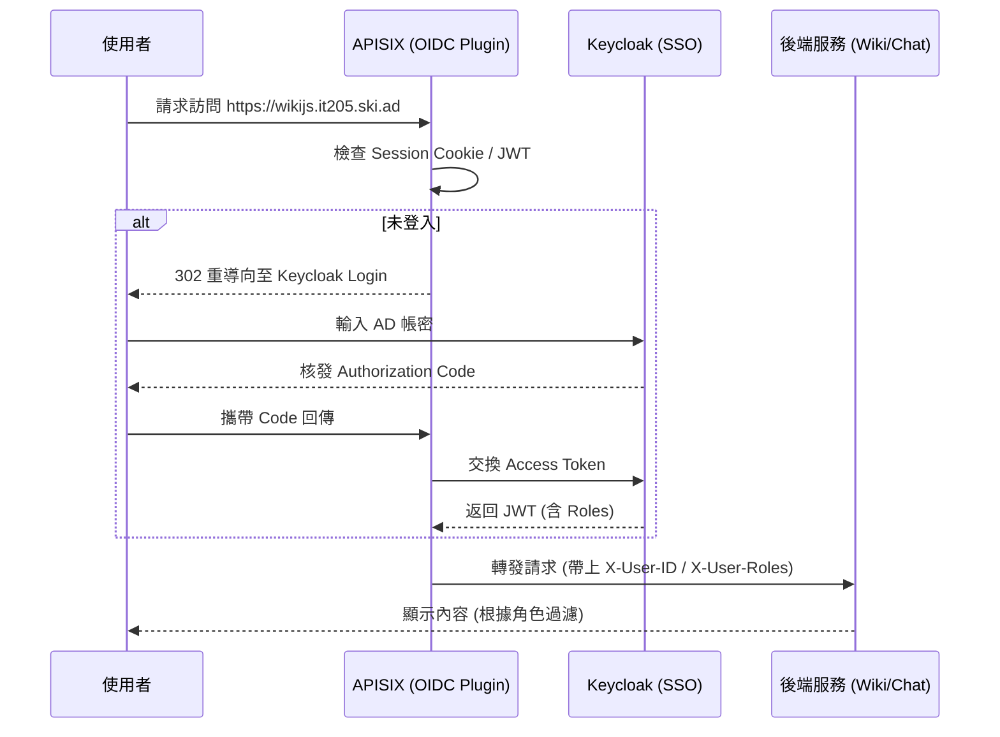

# APISIX 網關架構與服務路由 (Milk 整理)

根據最新研究進度（2026-02-04），APISIX 將負責整合 Keycloak SSO 認證，並對後端 AI 服務進行流量管制。

## 1. 🏗️ 全系統流量流程圖 (Gateway Flow)

## 2. 🏗️ 認證攔截循序圖 (Auth Interception)

## 3. 流量入口配置
- **HTTP**: 9080
- **HTTPS**: 9443 (強制啟用 SSL)
- **Admin API**: 9180 (受 IP 白名單保護)
- **Dashboard**: 9000 (受 Keycloak 保護)

## 4. 服務路由清單 (Upstream Services)
| 服務名稱 | 內部埠號 | 認證模式 | 外部域名 (*.it205.ski.ad) |
| :--- | :--- | :--- | :--- |
| Keycloak | 8080 | N/A | auth.it205 |
| Wiki.js | 3000 | OIDC | wikijs.it205 |
| Mattermost | 8065 | OIDC | mattermost.it205 |
| OpenClaw | 18789 | Key-Auth | agent.it205 |
| Ollama | 11434 | Internal | ollama.it205 |
| AnythingLLM | 3001 | Internal | anythingllm.it205 |

## 5. 優化方向 (2026-02-04 更新)
- **Rate Limiting**: 針對 `agent.it205` 的 `/v1/chat/completions` 進行限流，防止特定用戶耗盡 Ollama 資源。
- **Logging**: 整合 APISIX `http-logger` 將流量日誌發送至 Logstash，以滿足 PII 數據稽核需求。

