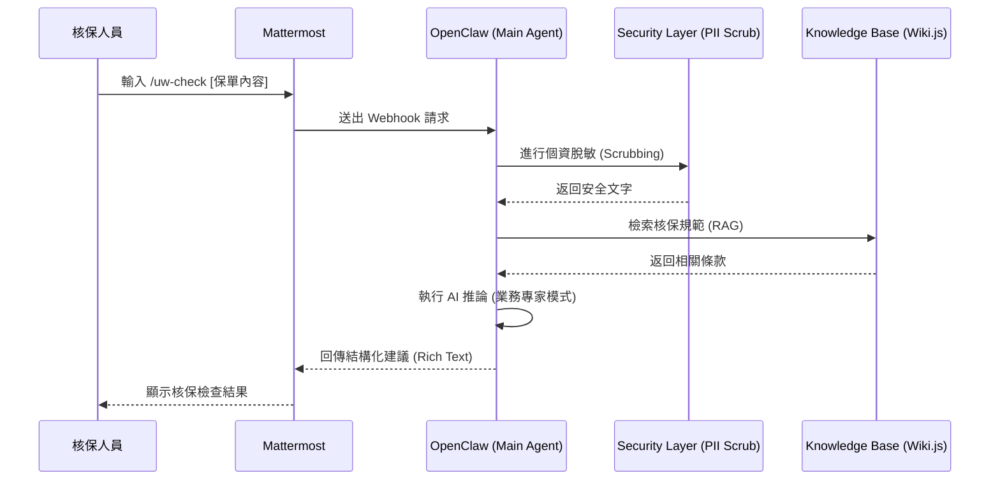

# Mattermost 與 OpenClaw AI 員工整合設計方案

## 1. 交互流程設計 (Mermaid)

本方案採用 Slash Command 模式，讓核保人員能即時調用 AI 能力。

## 2. Slash Commands 定義
*   **/uw-manual [關鍵字]**：檢索內部 Wiki.js 中最新的核保手冊內容。
*   **/uw-check [文本]**：對一段保單描述進行規則比對，找出潛在風險點。

## 3. 安全性實作
*   所有通過 `/uw-` 系列指令的輸入輸出，均強制經過 `milk-ai-mcp-insuretech` 模組的 PII 清洗邏輯，確保身分證、電話等資料不外洩。
