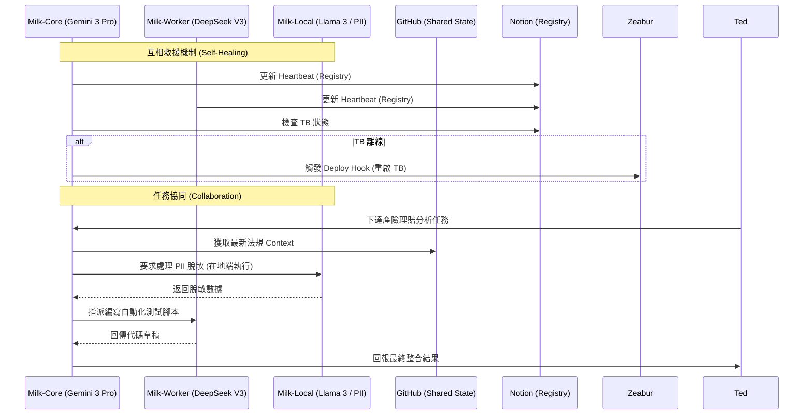

# 分散式 Milk 集群與自我修復機制研究 (Milk Swarm & Self-Healing)

## 1. 核心願景
將 Milk 從單一節點 (Single Point of Failure) 轉化為「分散式代理人集群」。多個 Milk 分身可跨雲端 (Zeabur, Azure) 與在地端 (Ted's PC) 同時運作，具備協同作業與互相救援的能力。

## 2. 🏗️ 集群互動架構 (Swarm Interaction)

## 3. 技術實現路徑

### A. 狀態共享 (Shared State)
- **機制**：利用目前的 `milk-workspace-backup` 作為分散式檔案系統 (Pseudo-Distributed FS)。
- **同步**：各分身定時 `pull` 最新記憶，確保「意識」同步。

### B. 互相監測與救援 (Heartbeat & Rescue)
- **機制**：在 Notion 或 GitHub 建立一個 `registry.json`。
- **流程**：
    1. 每個分身每 10 分鐘更新自己的 `last_seen` 時間戳。
    2. 若 Milk-A 發現 Milk-B 的時間戳超過 30 分鐘未更新，則判定 Milk-B 損毀。
    3. Milk-A 呼叫雲端 API (如 Zeabur Deploy Hook) 重新啟動 Milk-B 容器。

### C. 協同作業 (Collaboration)
- **任務拆解**：主 Milk 將大型任務（如產險法規分析）拆解為子任務。
- **分工**：透過 Mattermost 頻道或專屬工作佇列 (Queue) 指派給不同的分身執行。

## 4. 企業級應用價值
這套「自我修復集群」可以直接整合進 *openclaw-enterprise-security-insuretech*，提供企業級的高可用性 (High Availability) AI 服務。

### D. 異質集群 (Heterogeneous Swarm)
- **概念**：允許不同節點使用不同的 LLM 模型。
- **優勢**：
    - **專才分工**：Milk-A (Gemini 3 Pro) 負責邏輯推理與架構設計；Milk-B (DeepSeek-V3) 負責程式碼開發；Milk-C (Local Llama 3) 處理 PII 敏感資料。
    - **成本優化**：輕量任務派發給 Flash 模型，核心任務才喚醒 Pro 模型。
    - **冗餘彈性**：當其中一個模型提供商發生故障（如 Google API 當機）時，使用 OpenAI 或 DeepSeek 的分身仍能維持集群運作。
