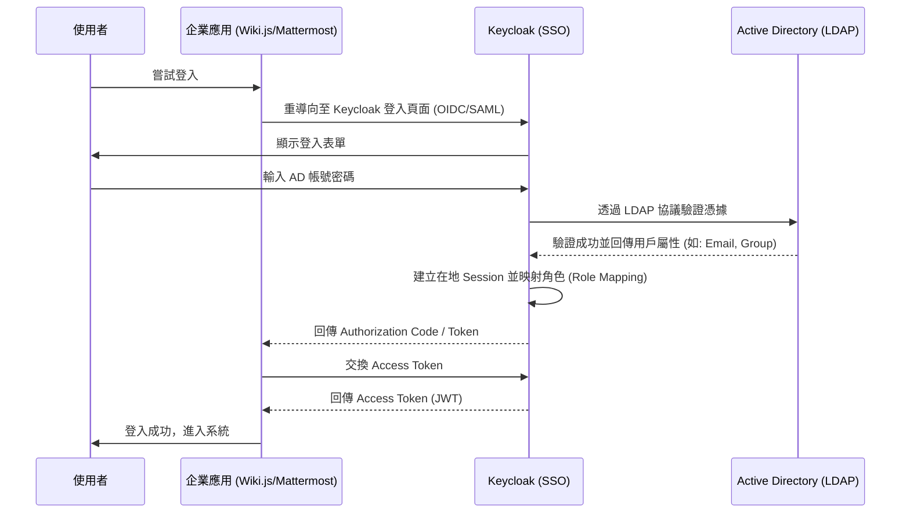

# Keycloak 與 Active Directory (AD) 整合研究紀錄

## 1. 整合目標
實現在 `enterprise-ai-knowledge-integration` 專案中，各個服務（Wiki.js, Mattermost, AnythingLLM）能透過 Keycloak 統一進行身份驗證，並同步企業內部的 AD/LDAP 用戶資料。

## 2. 🏗️ 認證流程 (Authentication Flow)

## 3. LDAP 同步細節 (LDAP Synchronization)

### Keycloak User Federation 配置
- **Edit Mode**: `READ_ONLY` (建議保持 AD 為 Single Source of Truth)。
- **Sync Registrations**: `OFF` (不允許在 Keycloak 註冊用戶回傳 AD)。
- **Vendor**: `Active Directory`。
- **Connection URL**: `ldaps://ad.example.com:636` (建議使用加密連線)。

### 屬性映射 (Mappers)
- **User Attribute Mapper**: 將 AD 的 `sAMAccountName` 對應至 Keycloak `username`。
- **Role Mapper (Group to Role)**: 
    - 使用 `group-ldap-mapper`。
    - LDAP Groups DN: `OU=Groups,DC=example,DC=com`。
    - Mode: `LDAP_AS_ROLES`。
    - 效果：AD 中的群組（如 `CN=Managers`）會自動在 Keycloak 中建立對應的 Client Role 或 Realm Role。

## 4. 技術實作重點
- **User Federation**: 在 Keycloak 中設定 LDAP Provider 連接 AD。
- **Mapper 設定**: 將 AD 的屬性（如 `memberOf`）映射為 Keycloak 的 Roles，實現權限控管。
- **信賴憑證**: 確保各 App 與 Keycloak 之間的 HTTPS 加密與 Client ID 設定正確。
