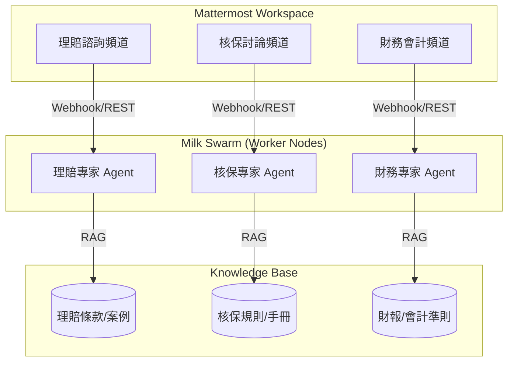

# Mattermost 業務專才模式 (Domain Expert Agents) 整合規劃

## 1. 核心理念
採用「一頻道一專家」或「標註呼叫專家」的模式，讓不同業務部門擁有專屬的 AI 知識接口。

## 2. 🏗️ 整合架構圖 (Architecture)

## 3. 實作路徑 (Action Items)
- **Bot Accounts**: 在 Mattermost 為每個業務專才建立專屬 Bot 帳號。
- **Slash Commands**: 實作 `/claims` 或 `/underwriting` 指令，讓員工能快速詢問特定領域問題。
- **RAG 隔離**: 確保理賠 AI 只能檢索理賠相關的知識庫，提高回應精準度。
- **OpenClaw 介接**: 透過 OpenClaw 的插件系統作為 Mattermost Bot 的後端推理引擎。
