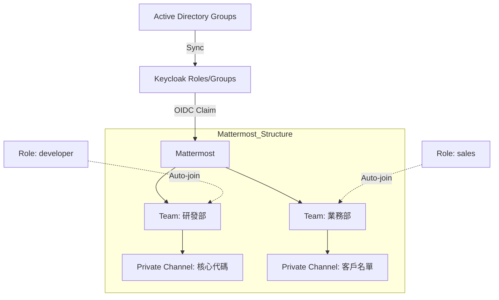

# Mattermost 與 Keycloak 整合及「業務職能模式」權限設計

## 1. 整合機制
Mattermost (Enterprise 版或 GitLab 版) 支援透過 GitLab SSO (其實就是 OIDC) 或直接透過 Generic OIDC 與 Keycloak 對接。

### Keycloak Client 設定
- Client ID: `mattermost`
- Access Type: `confidential`
- Redirect URIs: `https://mattermost.example.com/signup/openid/callback`

## 2. 業務職能模式 (Job-Function Based Access Control)
為了實現權限隔離，我們採用 Keycloak Groups 同步至 Mattermost Teams/Channels 的策略。

### 權限隔離架構

## 3. 具體配置步驟
1. **Keycloak Client Scope**: 確保 `profile` 與 `email` 範疇包含在內。
2. **Mattermost 設定**:
   - 進入 **System Console > Authentication > OpenID Connect**。
   - Discovery Endpoint: `https://keycloak.example.com/auth/realms/REALM/.well-known/openid-configuration`
   - Map `Username` to Keycloak `preferred_username`。
3. **Team/Channel 隔離**:
   - 啟用 **Group-Synced Teams** (Mattermost Enterprise 功能)。
   - 在 Mattermost 中連結 Keycloak 傳來的 Group Claim。
   - 設定規則：當用戶具備 `ad_sales` 群組時，自動加入 `Sales Team` 並限制其無法離開，且無法看到其他 Team。
