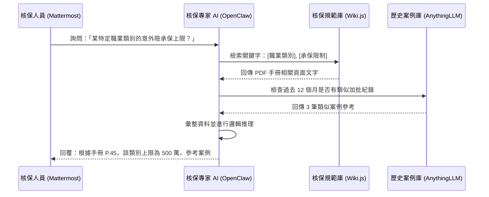

# 核保部門 AI 專家 Agent 實作規劃 (Underwriting Expert Agent)

## 1. 業務場景描述
核保部門的主要任務是根據公司規範評估風險，決定是否承保。AI 專家將協助核保人員快速檢索手冊、對比過往案例，並初步判定風險等級。

## 2. 🏗️ 核保決策輔助流程 (Decision Support Flow)

## 3. 技術實作要點
- **知識庫精準度**：核保手冊多為表格與條列，需要針對 PDF 解析進行優化（Layout-aware extraction）。
- **權限控管**：結合 Keycloak，確保只有核保部門人員能存取特定的「核保規則庫」。
- **決策透明度**：AI 的回覆必須標註資料來源（例如：手冊章節），以供核保人員最後查核。

## 4. 下一步行動
- 測試 Wiki.js 的搜尋 API 效率。
- 擬定核保專用 Mattermost Bot 的指令集（例如 `/uw-check [條件]`）。
