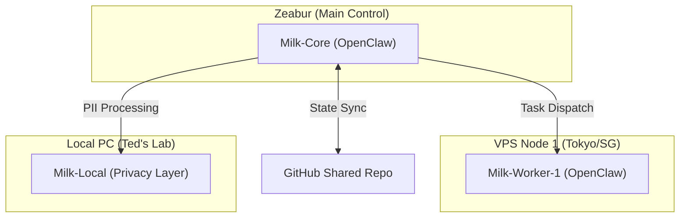

# VPS 分散式集群部署調研 (OpenClaw Distributed Cluster)

為了實現「Milk Swarm」分散式架構，我們需要選擇合適的 VPS 供應商來架設額外的 OpenClaw 節點。

## 1. 供應商評比 (VPS Provider Comparison)

| 供應商 | 推薦方案 | 價格 (月) | 優勢 | 缺點 |
| :--- | :--- | :--- | :--- | :--- |
| **DigitalOcean** | 1GB RAM / 1 vCPU | $6 USD | 介面直觀，API 完善，適合自動化重啟。 | 台灣連線速度中等。 |
| **Hetzner (德國)** | CPX11 (2GB RAM) | ~€4.5 EUR | 極致性價比，硬體規格高。 | 僅有歐美機房，延遲較高。 |
| **Linode (Akamai)** | 1GB Nanode | $5 USD | 穩定性極佳，有東京/新加坡機房。 | 界面較老舊。 |
| **Vultr** | 1GB Cloud Compute | $5 USD | 機房選擇極多（含東京），支持自定義 ISO。 | 計費較複雜。 |

---

## 2. 分散式部署架構 (Proposed VPS Deployment)

## 3. 部署自動化規劃
- **Docker Compose**：所有節點統一使用 Docker 部署，確保環境一致。
- **Tailscale**：建議透過 Tailscale 組建虛擬內網，讓各節點安全互連，不需暴露公網端口。
- **Heartbeat Script**：開發一個輕量級腳本，每分鐘檢查各節點 `openclaw health` 並回報至 Notion Registry。

## 4. 下一步行動建議
1.  **選擇機房**：考慮到與 Zeabur 及台灣的連線，優先選擇 **DigitalOcean (Singapore)** 或 **Vultr (Tokyo)**。
2.  **試運行**：先租用最低規 ($4-6 USD) 的方案進行單節點 Milk Swarm 測試。
